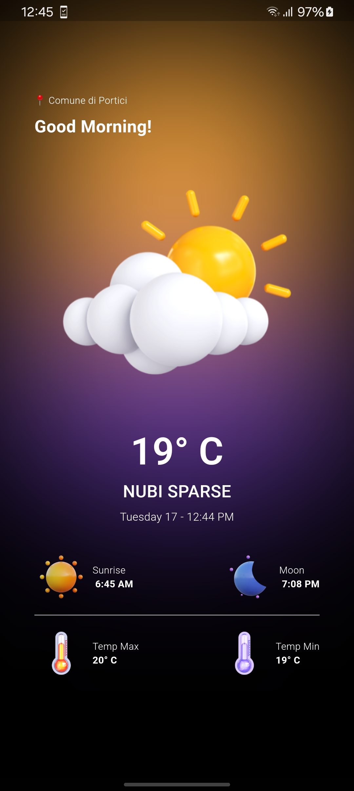

# Weather App - Flutter - BLoc

</a>

I  developed a weather app using Flutter and the BLoC architecture that provides real-time weather forecasts. The app features a responsive and intuitive interface, offering users current weather conditions for their location, with seamless state management for a smooth experience.

